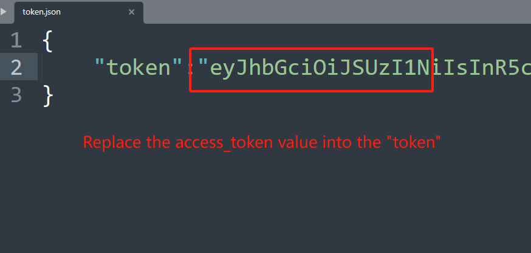

# Suno-StableAudio-API
A reversed and really simple API of suno and stable audio diffusion

# Installation

To set up this project, you need to install the `pydub` library. Ensure that your Python version is 3.8 or higher. Follow the steps below to install the necessary dependency:

1. **Check Python Version**: Ensure you are using Python 3.8 or above.

```
python --version
```

2. **Install pydub**: Use pip to install pydub:

```
pip install pydub
```

# Usage

## Suno

To run the Suno API, follow these three steps:

### Step 1: Copy Information from the Website


### Step 2: Paste Information into a Local File


### Step 3: Run the Code


## Stable Audio

To run the Stable Audio API, follow these three steps:

### Step 1: Copy Information from the Website


### Step 2: Paste Information into a Local File



### Step 3: Run the Code


